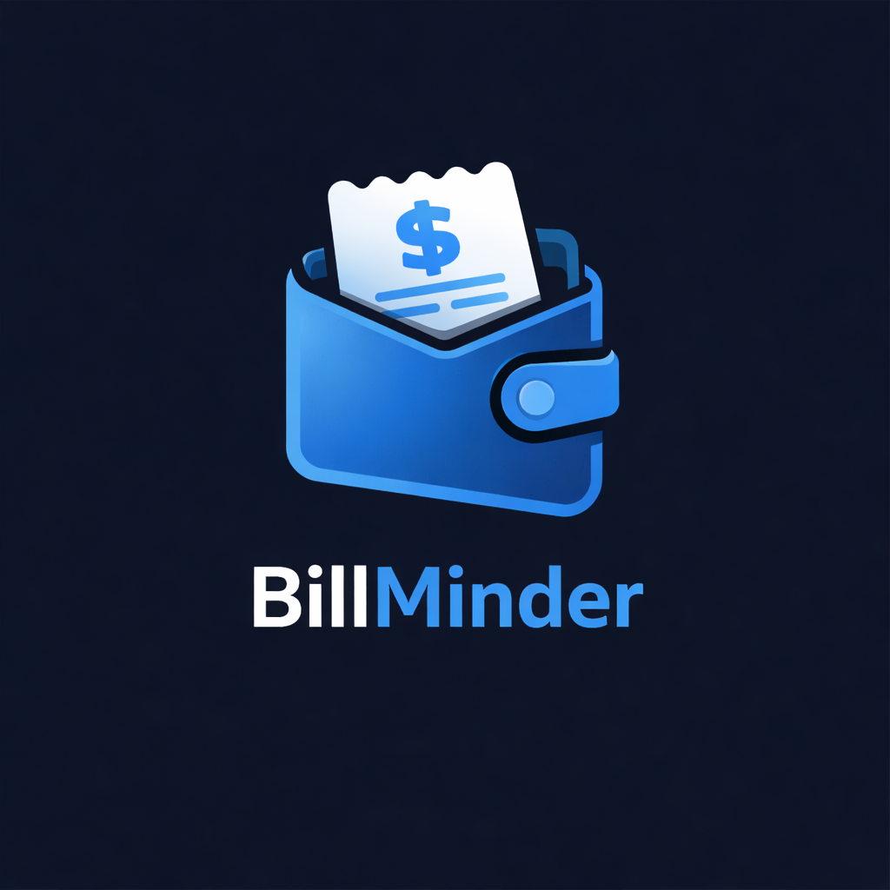

<!-- codex-branding:start -->
<p align="center"></p>

<p align="center">
  
  
  
</p>
<!-- codex-branding:end -->

# BillMinder v2.0.0

A bill tracking and reminder app for Android. Never miss a payment again.

## Features

### Core
- **Bill Management** - Add, edit, delete bills with name, amount, due date, category, recurrence, notes, tags, and payment URL
- **13 Categories** - Rent, Utilities, Insurance, Phone/Internet, Subscription, Loan, Medical, Transportation, Groceries, Education, Entertainment, Childcare, Other
- **6 Recurrence Types** - Weekly, Bi-Weekly, Monthly, Quarterly, Yearly, One-Time
- **Quick Mark Paid** - One-tap from home screen or notification
- **Swipe-to-Delete** - Swipe left on any bill to delete

### Reminders (Alarm-Style)
- **Exact Alarms** - Uses AlarmManager.setAlarmClock() for reliable delivery (same as alarm clock apps)
- **7 Reminder Timings** - Day of, 1/2/3 days, 1/2 weeks, 1 month before
- **Dual Reminders** - Two separate reminders per bill
- **Snooze** - 1 hour or tomorrow snooze directly from notification
- **Boot Persistence** - Reminders survive device restarts
- **Overdue Notifications** - Persistent (non-dismissible) for overdue bills

### Dashboard
- **Monthly Summary** - Total due, paid, remaining with animated progress bar
- **Section Badges** - Overdue/Upcoming/Paid sections with count badges
- **Search** - Full-text search across bill names, notes, and tags
- **Sort** - By due date, amount, name, or category
- **Filter** - Horizontal scrollable category filter chips
- **Staggered Animations** - Bills animate in sequentially

### Calendar
- **Monthly Calendar View** - Color-coded dots for bills on each day
- **Day Detail** - Tap any day to see bills due

### Stats & Charts
- **Lifetime Spending** - Total across all bills
- **Category Pie Chart** - Animated donut chart with legend
- **Monthly Trend** - 6-month line chart with grid
- **Per-Bill Lifetime** - Total spent on each individual bill with average

### Data
- **JSON Backup/Restore** - Full export and import of all data
- **CSV Export** - Payment history as spreadsheet
- **Room Database** - SQLite with migration support

### Security
- **Biometric Lock** - Fingerprint/face unlock to protect financial data

### Widget
- **Home Screen Widget** - Glance-based widget showing upcoming bills, amounts, and days until due

### UI/UX
- **Bottom Navigation** - Home, Calendar, Stats, Settings tabs
- **AMOLED Dark Theme** - Catppuccin Mocha throughout
- **Edge-to-Edge** - Full immersive display
- **Auto-Pay Tags** - Visual badge on auto-pay bills

## Tech Stack

- Kotlin 2.1.0 + Jetpack Compose + Material 3
- Room 2.6.1 with migrations
- AlarmManager for exact alarm-style reminders
- Glance 1.1.1 for home screen widget
- AndroidX Biometric for fingerprint/face lock
- Navigation Compose with bottom nav
- Canvas-drawn pie chart and trend line (no chart libraries)
- DataStore for preferences

## Build

```bash
./gradlew assembleDebug
```

APK output: `app/build/outputs/apk/debug/app-debug.apk`
