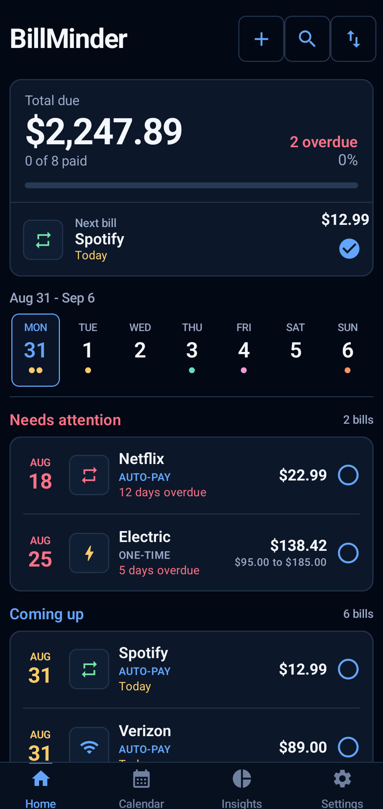
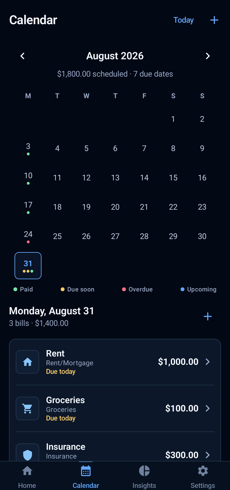
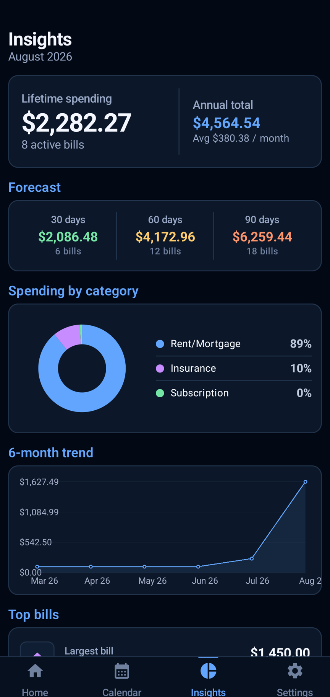
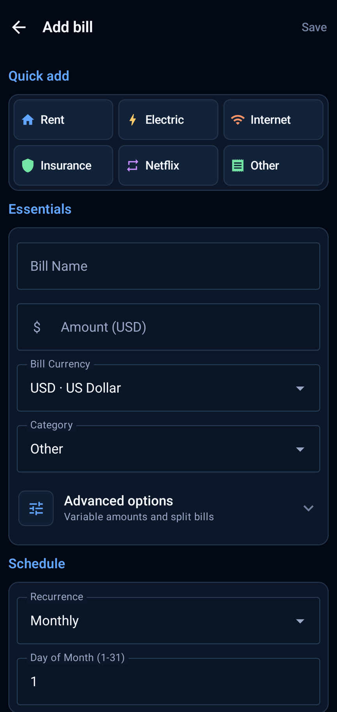
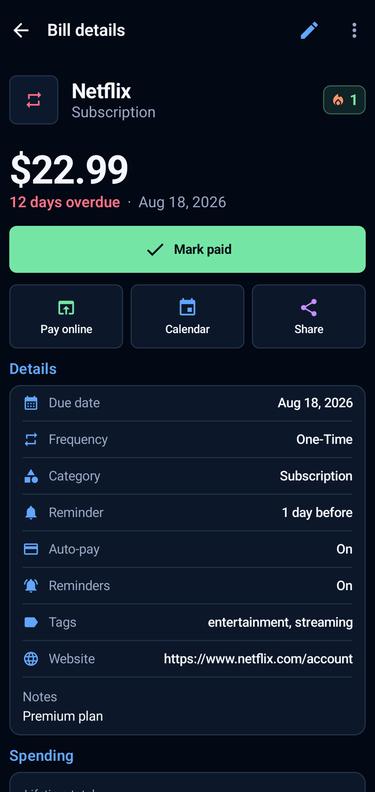
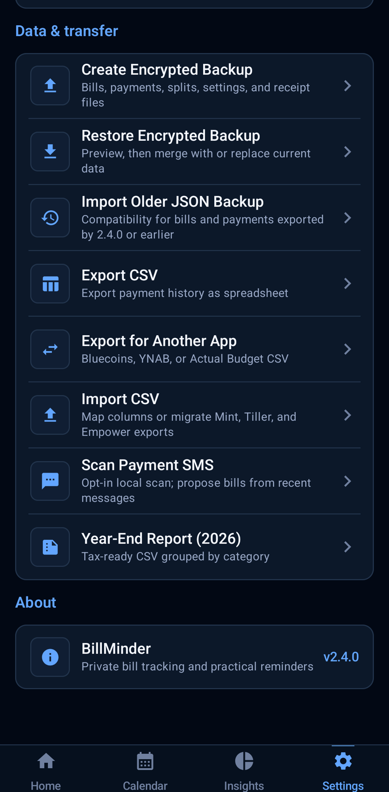

# BillMinder v2.4.0

BillMinder keeps recurring bills, due dates, and payment history in one Android app. It works offline and asks for no network permission.

## Screenshots

| Home | Calendar | Insights |
| --- | --- | --- |
|  |  |  |

| Add bill | Bill details | Settings |
| --- | --- | --- |
|  |  |  |

## What it tracks

- Bills can carry an amount, due date, category, notes, tags, a payment URL, and optional receipt files.
- Six schedules cover weekly, biweekly, monthly, quarterly, yearly, and one-time bills. Every occurrence stays anchored to the date the user chose.
- Payment history is tied to the exact occurrence. An unpaid cycle stays overdue instead of disappearing when the next cycle begins.
- Variable amounts and percentage splits handle utility bills or shared household costs.
- Each bill keeps its native currency. Dashboard totals use an offline FX snapshot with optional manual overrides.

The Home page has search, category filters, due-state groups, and one-tap payment actions. Calendar shows the actual occurrences for each day. Monthly totals count every due occurrence, including all weekly dates, and stay aligned across Home, Calendar, forecasting, cash-flow planning, and widgets. Insights covers category totals, budgets, forecasts, annual cost, and a paid-versus-outstanding plan.

## Reminders

BillMinder schedules two optional reminders per bill, and reminders fire at 9:00 in your local time zone. Available timing ranges from the due day to one month ahead.

The app declares `USE_EXACT_ALARM`, so Android 12 and newer grant exact alarms without a settings trip. If exact alarms are ever unavailable the reminder still runs: it falls back to an alarm that fires through Doze but is not held to an exact minute, so it can arrive late rather than not at all. Settings shows the live state for notifications and exact alarms.

The alarm-style full-screen reminder is different. Android 14 stopped granting full-screen alerts to apps outside the calling and alarm categories, so BillMinder starts denied on those versions. Turning the setting on shows a prompt to grant it, and until you do, those reminders arrive as an ordinary heads-up notification instead of quietly doing nothing.

Notifications include Paid, one-hour snooze, and tomorrow actions. Unpaid bills get a separate overdue alert. Reminders are rebuilt after a reboot, app update, clock change, or timezone change.

There is also an optional alarm-style due screen and an opt-in local scan of recent payment texts. If you would rather not grant inbox access, share one payment message to BillMinder and it proposes a bill from that instead.

## Privacy and security

- Biometric unlock requires a PIN fallback, so loss of biometric access cannot lock the user out.
- PIN and duress PIN records use versioned PBKDF2-HMAC-SHA256 with a random salt and 600,000 rounds. Older PIN records migrate after the next successful entry.
- Five incorrect entries start a persisted wait. Continued failures increase the delay up to one hour, while a successful PIN or biometric unlock clears it.
- Screenshot protection follows the live lock setting. Turning security on applies it without restarting the app.
- Private Notifications & Widgets replaces bill names and amounts on external surfaces. Hide Amounts in App masks financial values throughout the read-only UI.
- Receipt images and PDFs stay encrypted in app-private storage. OCR runs on the device with the bundled ML Kit model.

The app declares no internet or location permission, and it makes no network calls: the OCR model ships inside the APK. There is no analytics SDK, crash reporter, billing library, or bank connection.

Everything in the installed app's permission list, and why:

| Permission | Used for |
| --- | --- |
| `POST_NOTIFICATIONS` | Bill reminders and overdue alerts. |
| `SCHEDULE_EXACT_ALARM`, `USE_EXACT_ALARM` | Firing a reminder at its scheduled minute. |
| `USE_FULL_SCREEN_INTENT` | The optional alarm-style due screen. Off until you turn it on. |
| `READ_SMS` | The optional local scan of recent payment texts. Off until you turn it on, and requested only at that point. Messages are read on the device and nothing about them leaves it. |
| `RECEIVE_BOOT_COMPLETED` | Rebuilding alarms after a restart. |
| `VIBRATE`, `WAKE_LOCK` | Delivering a reminder on a sleeping device. |
| `USE_BIOMETRIC` | Fingerprint and face unlock for the app lock. |
| `USE_FINGERPRINT` | The pre-Android-9 path of the same unlock, added by androidx.biometric. |
| `FOREGROUND_SERVICE` | Added by ML Kit. BillMinder starts no foreground service. |
| `DYNAMIC_RECEIVER_NOT_EXPORTED_PERMISSION` | Signature-level, added by AndroidX. Only the app's own process can use it. |

`ManifestPermissionsTest` fails the build if the merged manifest gains a permission outside that table, loses one the app depends on, or picks up a network or location permission from a library.

## Data and portability

CSV import starts with a preview and supports learned column mappings plus Mint, Tiller, and Empower presets. Exports include payment CSV, year-end CSV, and formats for Bluecoins, YNAB, or Actual Budget.

Portable `.bmbak` files include bills, cycle payments, split payees, supported settings, and receipt bytes. Each file is protected with a user passphrase using PBKDF2-HMAC-SHA256 and AES-256-GCM. Restore checks the full file before showing a preview, then offers merge or replace. A bad passphrase, damaged file, duplicate record, or unsupported schema leaves current data unchanged.

Older partial JSON backups from BillMinder 2.4.0 and earlier can still be imported. They contain bills and payments only. The [portable backup format](docs/BACKUP_FORMAT.md) documents the container, included settings, limits, and recovery behavior.

Android's automatic app-data backup is disabled. Its device transfer can restore encrypted receipt files without their device-bound key, which would leave the files unreadable. Use an encrypted `.bmbak` file to move data between devices.

Room stores the live data and has explicit migrations for every shipped schema. An unreadable database is left untouched and shown through the recovery screen.

## Current builds

BillMinder is distributed as a sideloaded APK from GitHub Releases. There is one build and it carries every feature, including the local SMS scanner, full-screen reminders, and `USE_EXACT_ALARM`. Store publishing is not part of the release process.

The build requests no network access. SMS reading, full-screen reminders, and exact-alarm auto-grant stay optional at runtime, so the app asks only once you turn the matching feature on.

## Build locally

Use JDK 21 and an Android SDK with API 36 installed.

```bash
./gradlew :app:assembleDebug
```

The APK is written under:

```text
app/build/outputs/apk/debug/
```

Run the JVM suite and Android lint before installing a build:

```bash
./gradlew test
./gradlew lint
```

### Signed release APKs

Copy the signing template and enter credentials for a keystore you control:

```bash
cp keystore.properties.example keystore.properties
```

The file is already ignored by Git. It accepts `storeFile`, `storePassword`, `keyAlias`, and `keyPassword`.

```bash
./gradlew :app:assembleRelease
```

The task stops with a direct error when signing details are missing. A successful build writes a signed, minified APK to `app/build/outputs/apk/release/`, and that APK is what a GitHub release ships.

## License

BillMinder is available under the [MIT License](LICENSE).
